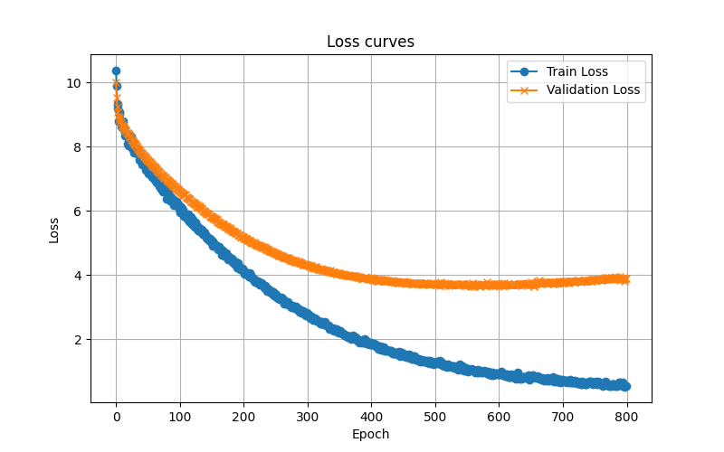

# 📖 Report

## ⚙️ Specifications

Reachy mini is a desktop robot that can be moved around, play music, and most importantly, communicated with. While this communication is currently mainly focused on speech, movement is deterministic and not very expressive of the situation. The challenge is therefore to improve non-verbal language in order to create a more expressive and social robot.

The project is limited to encoding the desired emotion (natural language if desired, such as “joy, 10 seconds”). The main objective is to develop algorithms in Python that would transform this input into verbal or gestural expression by manipulating the robot's nine degrees of freedom.

## Implemented approches

Three approaches were proposed to implement these expressions. The first, led by Amandine, involves adapting an existing movement according to the emotion the robot should feel. The second, led by Anaelle, involves generating the expression purely from a natural language command. Finally, the last approach, programmed by Clément, involves generating sound based on input from an emotional space, then synthesizing it, inspired by R2D2.

## Approach 1: Movement Adaptation 🎛️

### Overview

This approach aims to **adapt a functional movement** (like YES/NO) to convey an emotional state expressed through PAD coordinates (Pleasure, Arousal, Dominance).  
The goal is not only to execute the motion but also to make it **emotion-dependent**, with **expressive amplitude, frequency, and temporal shaping**.

---

### Execution Paradigm: `goto_target` vs `set_target` 🏃‍♂️⚡

Two fundamental functions can be used to command the robot:

- **`goto_target(position, duration)`**  
  Moves the robot from its current posture to the target position **over a specified duration**.  
  ✅ Advantage: simple, ensures smooth arrival.  
  ⚠️ Limitation: the temporal profile is fixed, making it hard to manipulate amplitude, frequency, or introduce complex oscillations.

- **`set_target(position)`**  
  Sets the robot’s position **instantaneously at the next control step**.  
  ✅ Advantage: gives **full control over the motion evolution**, allowing the implementation of:
  - Oscillations at specific **frequencies**  
  - Gradually changing **amplitudes**  
  - Complex **temporal shaping** (crescendo, decrescendo, expressive timing)  
  ⚠️ Limitation: requires careful control of the **timestep** to ensure smooth, physically plausible motion.

> In this approach, `set_target` was chosen to gain **flexibility** and **fine-grained control** over the expressive motion.  
> This decision is **deliberate but debatable**, as it increases the complexity of motion generation and requires careful parameter tuning to avoid unnatural behavior.

---

### Methodology

#### PAD Mapping and Emotion Values 🎭

The movements in this approach are driven by the **PAD emotional model** (Pleasure, Arousal, Dominance), as theorized by Russell & Mehrabian:

- Russell, J.A.; Mehrabian, A. *Evidence for a three-factor theory of emotions.* J. Res. Personal. 1977, 11, 273–294. [CrossRef]

The PAD coordinates provide a **quantitative representation of emotions**. In our implementation:

- **Pleasure (P):** [-1, 1] → negative values indicate unpleasant emotions, positive values indicate pleasant emotions  
- **Dominance (D):** [-1, 1] → negative values indicate submissive/passive states, positive values indicate confident/controlling states  
- **Arousal (A):** [0, 1] → 0 = low energy, 1 = high energy  

We use the canonical values for six basic emotions

| Emotion   | Pleasure | Arousal | Dominance | Interpretation |
|-----------|----------|---------|-----------|----------------|
| Joy       | 0.76     | 0.48    | 0.35      | High pleasure, medium arousal, confident |
| Sadness   | -0.63    | 0.27    | -0.33     | Low pleasure, low arousal, submissive |
| Anger     | -0.43    | 0.67    | -0.13     | Negative pleasure, high arousal, low confidence |
| Fear      | -0.64    | 0.60    | -0.43     | Negative pleasure, high arousal, very submissive |
| Disgust   | -0.60    | 0.35    | 0.11      | Negative pleasure, low-medium arousal, slightly confident |
| Surprise  | 0.40     | 0.67    | -0.13     | Positive pleasure, high arousal, low confidence |

> For other emotions not covered by the classical six, values can be **proposed using a large language model (LLM)** based on these reference points.  
> Example:
> - "Curiosity" → (0.30, 0.60, 0.20)  
> - "Boredom" → (-0.20, 0.25, -0.10)  
> While this is **not scientifically validated**, it allows generalizing the approach to a wider set of emotions described by natural language.

#### PAD to Motion Correspondence 🌀

Each PAD dimension influences **different aspects of the robot’s motion**, inspired by **Laban Movement Analysis**:

| PAD Dimension | Laban Parameter | Motion Effect |
|---------------|----------------|---------------|
| Pleasure      | Space / Amplitude | High/Low pleasure → larger instantaneous head swings; neutral → subtle movements |
| Arousal       | Speed / Energy  | Sets maximum amplitude and energy; higher arousal → more vigorous motion |
| Dominance     | Fluidity / Temporal shaping | Positive dominance → crescendo (growing amplitude) and slower, controlled oscillations; negative → decrescendo and faster, jittery movements |

> **Note:** The correspondence between PAD and Laban parameters is exploratory. The exact coefficients and formulas used in the code were chosen heuristically, to test whether these mappings could produce natural, expressive movements.  
> These choices are **not scientifically validated**, but serve as a **proof-of-concept** for emotion-driven motion adaptation.
---

### Reflection on the Approach

## Approach 2 : Movement generation

The approach n°2 focuses on total generation. It is based on the following idea: thanks to reachability rules, a random movement is executed by Reachy Mini. This movement should not be fully random: it can be influenced by expressiveness. This expressiveness is created by 3 parameters:
- Pleasure (P\)
- Arousal (A)
- Dominance (D)

Each emotion can be described in a PAD space. For instance, joy can be illustrated by a certain level of pleasure, of arousal and of valence. Thus, it can be translated into coordinates, between -1 and 1.

Then, these coordinates can be used into a function which generates a random movement influenced by it. For instance, the higher the value of Pleasure, the higher can be the antennas of the robot.

The same principle is used to generate a random expressive sound.

### Overview of the methodology

The main logic behind this approach is the following one:

1. As input, the program asks the user to enter a desired **emotion** and a **minimal duration**.

2. The emotion is browsed in the [pad.json](../../src/movement_sound_generation/emotional_space/pad.json) file. Each emotion correspond to a set of 3 parameters according to the PAD (Pleasure-Arousal-Dominance) model, between 0 and 1.

    **Note:** To be scientifically rigorous, they should be between -1 and 1. However, the program actually uses values between 0 and 1. In the next days, a convertion file will be created, to have emotions described in the real PAD model.

3. The P, A and D coordinates are used to generate a pose in the robot space. This is made by the `generate_pose(P, A, D)` function of the [pose_generation.py](../../src/movement_sound_generation/robot_config_space/pose_generation.py) file.

4. The P, A and D coordinates are also used to generate a sound. This is made by the `generate_sound(P, A, D)` function of the [sound_generation.py](../../src/movement_sound_generation/sound/sound_generation.py) file.

5. The generated pose and sound are pushed on the robot by the [main script](../../src/movement_sound_generation/generate.py), through the `reachy.goto_target()` function for the pose and the `reachy.media.push_audio_sample()` function for the sound.

6. Until the minimal duration is not reached, other sets of pose and sound are generated.

### Evaluation methodology

For now, this approach is still experimental and still being evaluated. Developpers launch the script, evaluate the behavior seen in simulation and change parameters in the code according to it.

However, the intented way of evaluating it would be to replace the movement generation and sound generation functions by a neural network. This agent would be able to modify itself the parameters. Hence, human feedback from all the users could be used, sent to the neural network and allow the parameters to fit a more realistic behaviour for Reachy Mini.

### Conclusion

For now, this approach is satisfying. When the simulation is launched, Reachy Mini does have an expressive behaviour, with poses and sound.

However, this behaviour can be enhanced, and there are a lot of possibility to keep experimenting.

### Perspectives

- Convert the PAD emotions into the conventional space, from -1 to 1, as it is from 0 to 1 for now. A [-1; 1] -> [0; 1] transfer script can be created for this.

- Eventually adapt the scripts to be functional on coordinates from -1 to 1, which avoid a [-1; 1] -> [0; 1] transfer script.

- Enhance emotional conversion by more coding-testing.

- Clear the scripts by replacing rough values into it by global constants that can be changed during the evaluating tests.

- Create a neural network that automatically tunes parameters thanks to user feedback.

## Approach 3 : Sound generation
The goal of this approach is to generate a sound reaction similar to those of R2D2 from an emotional input.

Since it is difficult to automate the emotion felt when listening to a sound, the main technology used is reinforcement learning with human feedback (RLHF). It is humans who will rate the AI's creations, and the system should improve with experience. Generation starts with 100% exploration, which means that these generations are completely random and it is difficult to rate a feeling based on randomly placed notes. This is why the model must be pre-trained in order to produce “acceptable” generations.
After failing to find any datasets, I decided to create my own using NPC sounds found on the website *https://sounds.spriters-resource.com/*. An interface allowed me to label the sounds I was interested in and delete the others. All that remained was to encode the sounds I kept in the RL output format.

The metric for evaluating the model's effectiveness is the loss function used in it. For the pre-training policy, Cross-entropy is used because it is designed for multi-class classification.

We obtain for the pre-training these results : 

The optimal number of epochs with these parameters is around 300. After 300 the validation loss derivative is positive meaning overtraining. 

After training on 300 epochs and some evaluations on RLHF, I tried generate different emotions. It seems some correlation have been made. For example, all of "joy" sound are very short one-note. It can be explained by the fact that short sounds in the dataset were more likely to be short victory sounds of NPCs. Overall I would have to upgrade 3 things to have exploitable results : 
* Bigger Dataset
* Better "sound to note sequence" algorithm
* Longer training with RLHF 

Even with better results, the generation can be enhance by : 
* Implementing a continuous generation evaluation system to passively improve the model with RLHF
* Improving voice synthesis
* Adding more output parameters

## Conclusion
These 3 approaches are all different, yet relevant. They illustrate that from a single point of start, there are many ways to find a solution. Thanks to this experimental work, the Pollen Robotics community will be able to implement expressiveness on Reachy Mini, inspired from the approach they like.

Overall, implementing an expressive behaviour on Reachy Mini allows it to be better accepted in the human society. Expression is a key in communication between human, and so in a robot-human exchange. This will help end users to have a better acceptation of robots, which objective is to be a helpful tool for them.