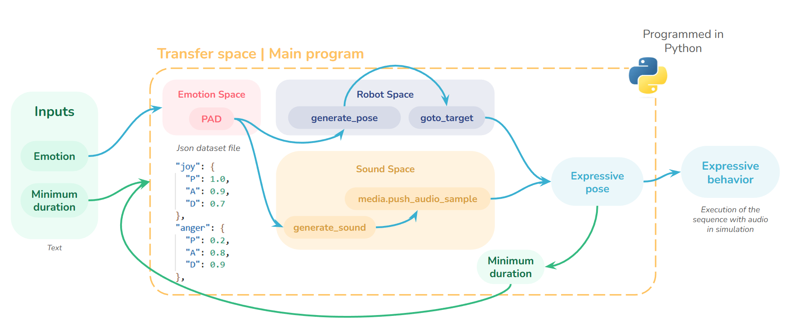

# Movement and sound generation

_**Author:** Anaelle JAFFRÉ_

If you see this, you certainely are a curious developper 🖥️. Welcome to this section!

In the next lines, the approach n°2 to create an expressive behaviour on Reachy Mini will be explained. Here is the plan followed by this document:

- [Movement and sound generation](#movement-and-sound-generation)
  - [Methodology description](#methodology-description)
  - [Architecture](#architecture)
  - [Core description](#core-description)
    - [Pose generation](#pose-generation)
      - [Overview](#overview)
      - [Pleasure $P$ influence](#pleasure-p-influence)
      - [Arousal $A$ influence](#arousal-a-influence)
      - [Dominance $D$ influence](#dominance-d-influence)
      - [Randomness](#randomness)
    - [Sound generation](#sound-generation)
    - [What are these rough values?](#what-are-these-rough-values)
    - [Rules extraction](#rules-extraction)
  - [If you have questions](#if-you-have-questions)


## Methodology description

The main idea behind this approach is the following one:



1. As input, the program asks the user to enter a desired **emotion** and a **minimal duration**.

2. The emotion is browsed in the [pad.json](emotional_space/pad.json) file. Each emotion correspond to a set of 3 parameters according to the PAD (Pleasure-Arousal-Dominance) model, between 0 and 1.

    **Note:** To be scientifically rigorous, they should be between -1 and 1. However, the program actually uses values between 0 and 1. In the next days, a convertion file will be created, to have emotions described in the real PAD model.

3. The P, A and D coordinates are used to generate a pose in the robot space. This is made by the `generate_pose(P, A, D)` function of the [pose_generation.py](robot_config_space/pose_generation.py) file.

4. The P, A and D coordinates are also used to generate a sound. This is made by the `generate_sound(P, A, D)` function of the [sound_generation.py](sound/sound_generation.py) file.

5. The generated pose and sound are pushed on the robot by the [main script](generate.py), through the `reachy.goto_target()` function for the pose and the `reachy.media.push_audio_sample()` function for the sound.

6. Until the minimal duration is not reached, other sets of pose and sound are generated.

## Architecture
The architecture is set as follows:

- [generate.py](generate.py) | Main script.
  
- **emotional_space**
    - [pad.json](emotional_space/pad.json) | Json dataset file which contains some emotions and their coordinates into the PAD space.

- **sound**
  - [sound_generation.py](sound/sound_generation.py) | File which contains useful functions to generate a random sound influenced by PAD values.

- **robot_config_space**
    - [pose_generation.py](robot_config_space/pose_generation.py) | File which contains useful functions to generate a random pose influenced by PAD values.

    - **rules** | Folder which contains two set of rules, for the robot not to go through unreachable positions.
      - [rules_1.json](robot_config_space/rules/rules_1.json)
      - [rules_2.json](robot_config_space/rules/rules_1.json) | Rules values which are currently used to generate the pose. Not perfect, but better than the 1st one.
  
    - **experimental** | Folder which contains test files.
      - [test.py](robot_config_space/experimental/test.py) | Allows to send a pose to reach.
      - [robot_space_limit_testing.py](robot_config_space/experimental/robot_space_limit_testing.py) | Allows to launch a series of random poses, where the user has to evaluate their reachability. Generates a dataset.
      - [correlation_analysis.py](robot_config_space/experimental/correlation_analysis.py) | Analyze a dataset of evaluated poses to determine correlations between variables.
      - [rules_extraction.py](robot_config_space/experimental/rules_extraction.py) | Extract useful information, based on the correlation analysis results, to extract values to build rules for reachable positions.

- **images** | Folder which contains images used for documentation.

## Core description

The main scripts which are used to generate an expressive sequence of poses and sounds are generated by the [pose_generation.py](robot_config_space/pose_generation.py) and [sound_generation.py](sound/sound_generation.py) files. They are described in the following paragraphs.

After this, a description of the rules extraction to define the robot reachable space will be given.

### Pose generation

Into the [pose_generation.py](robot_config_space/pose_generation.py) script, there are two main functions which allow to convert emotions into movements. More precisely, they take as input 3 values: P, A and D. These are the PAD coordinates of the emotion in the PAD space, from the [pad.json](emotional_space/pad.json) file. P stands for Pleasure, A for Arousal and D for Dominance.

As output, they return a pose. The timing of the pose is supposed to be short enough so that within 10 seconds, the robot is able to create a sequence of approximately 3 to 20 poses.

The final pose which is pushed to Reachy Mini thanks to the `reachy.goto_target()` function takes as input:

1. ``head`` (4x4 matrice)
2. ``antennas`` (1D vector)
3. ``duration`` (float)
4. ``method`` ("linear", "minjerk", "ease", "cartoon")
5. ``body_yaw`` (float)

The ``head`` parameter can be computed internaly by the `create_head_pose()` function, made by the developpers of Reachy Mini. It needs 6 parameters:
1. ``roll``,  ``pitch``, ``yaw``
2. ``x``, ``y``, ``z``

In the [pose_generation.py](robot_config_space/pose_generation.py) script, most of these values are generated. Only the method will be set to "minjerk" by default.

The two main functions which generate their values are `moving_antennas(P, A, D, t)` and `generate_pose_from_pad(P, A, D)`. This second one calls the first one, according to the generated timing of the pose.

#### Overview

The script is organized as follows:

1. **Imports**.

2. **Parameters** | They define limit or useful values for the range of liberty of the robot variables.

3. **Rules loading** | The rules file is loaded. It contains parameter values to restrict the robot pose to a reachable space.

4. **Useful functions** | 3 functions, `noise()`, `rint()` and `wrap_angle()` are defined. They are used sometimes in the program.

5. **``moving_antennas()``** | Takes PAD values and the duration of the pose as input. Generates a 2x1 vector which contains values for the antennas.

6.  **``sample_pose()``** | Can be called instead of `generate_pose()`. Generates a random pose, restricted by the rules.

7.  **``generate_pose()``** | Takes PAD values as input. Generates pose parameters: 

    For the head, depending on rules:
    1. ``roll``,  ``pitch``, ``yaw``
    2. ``x``, ``y``, ``z``

    And general parameters:
    1. ``antennas`` (1D vector)
    2. ``duration`` (float)
    3. ``body_yaw`` (float)

The main function of the script is the `generate_pose()` function. It calls `moving_antennas()` to generate the value of the antennas vector. Those functions all use randomness, $P$, $A$ and $D$ to create appropriate values for the robot pose. Their influence is described in the following paragraphs.

#### Pleasure $P$ influence

In the two functions, the pleasure parameter $P$ influences the following movement variables:

- $pitch$ | The pitch is the rotation of the read, in the same sense as saying "yes". If $P$ is weak, $pitch$ will go high so that the head will wind down, and inversely.

- $antennas$ | The higher the value of $P$, the upper the direction of the antennas, and inversely. Hence, if there is no pleasure at all, antennas are supposed to wind down.

#### Arousal $A$ influence

Overall, the Arousal parameter $A$ has the role of an amplifier. Hence, almost all of the variables are modified by it:

- $x$ | This variable is the forward-backward translation made by the head. The more arousal there is, then the wider movements will be.

- $y$ | The same thing is done for $y$, the right-left translation of the head. At the difference that here, $A$ is squared, for more impact, as there is more free space.

- $roll$, $pitch$ and $yaw$ | All of the head rotations are amplified by an $A$ factor: the more energy there is in the emotional state, the more the robot will make wide movements.

- $body\_yaw$ | $A$ influences the $body\_yaw$ amplitude, which also depends on the head $yaw$ variable.

- $duration$ | The duration of the pose is influenced by arousal. It is longer for low Arousal, shorter for high Arousal. Hence, an emotional state with a high arousal value will have a tendency to concatenate short poses, and inversely.

- $antennas$ | 
  - Arousal distorts the base movement of the antennas.
  
  - The `non_symmetric` condition is defined thanks to $A$ and $D$. Weak dominance and a bit of arousal means confusion, which illustrates on the robot as a lack of symmetry.

  - Antennas can have a random drift, which is arousal-dependant. The higher the value of $A$, the higher can be the drift.

#### Dominance $D$ influence

The Dominance parameter $D$ influences the following movement variables:

- $z$ | This variable is the up-down translation of the head. If one is very confident, which illustrates by a high value for $D$, then the head will be upper, and inversely.
  
- $yaw$ and $body\_yaw$ | If the robot is in control, then it will have a higher tendency to look forward. This is made by multiplicating $yaw$ and $body\_yaw$ by an $\frac{1}{D}$ factor, as their center is 0.

- $antennas$ |

  - As precised upper, the `non_symmetric` condition is defined thanks to $A$ and $D$.
  
  - The random drift of the antennas is also influenced by dominance. The more confident the robot should seem, the less the antennas should have random movements. Hence, here also, there is an $\frac{1}{D}$ factor.

#### Randomness

To generate different poses each time, randomness must be added to the model. Here are the variables it impacts:

- $x$, $y$ and $z$ | The prismatic position of the head is generated randomly within a realistic range, which depend itself on emotional parameters.

- $roll$, $pitch$ and $yaw$ | The rotational variables depend on rules, set by experiment in the [`rules_2.json`](rules_2.json) file, wo that the robot tries not to reach unreachable position.

    These rules imply that they depend on their most correlated prismatic variable, and so on randomness. For instance, $roll$ is highly correlated with $y$; thus, it will be influenced by its new value for each pose.

    Additionally, a small random noise is being added, for more chaos.

- $body\_yaw$ | The direction of the robot in front of the user is created by a random choice in a range that depends on the head $yaw$ and $A$ values.

- $duration$ | The duration of the pose is multiplicated by a random factor, which also depends on arousal.

- $antennas$ | The drift of the antennas is a random number taken within a determined range, which depends on $A$ and $D$.


### Sound generation


### What are these rough values?

You may have noticed the lines which correspond to the previous computations contains "rough" values. For instance, in:

```
ant0 = base_angle + 0.2 * random.uniform(-A * math.pi, A * math.pi) 
```

It defines the base value for one of the antennas. What does `0.2` stands for? Why this, why not `0.3`?

All of these values are set by hand, as tests have been made and for now, they have been determined to be **satisfying values** to create a realistic expressive movement. They sometimes allow to restrict or amplify the movement, the randomness degree or the influence of an emotional parameter. 

For now, as this is only experimental, they are just set as rough values. However, they could be set into the ``PARAMETERS`` section under signifiant names, for proper code.

### Rules extraction

Rules extraction is necessary to allow the reachabilty of a pose.


## If you have questions

Feel free to contact me if you have any question about the program, the methodology, other applications or just by curiousity. You can send me an email at Anaelle.Jaffre@ensc.fr or contact me on [LinkedIn](https://www.linkedin.com/in/anaelle-jaffr%C3%A9-441a981a2/).