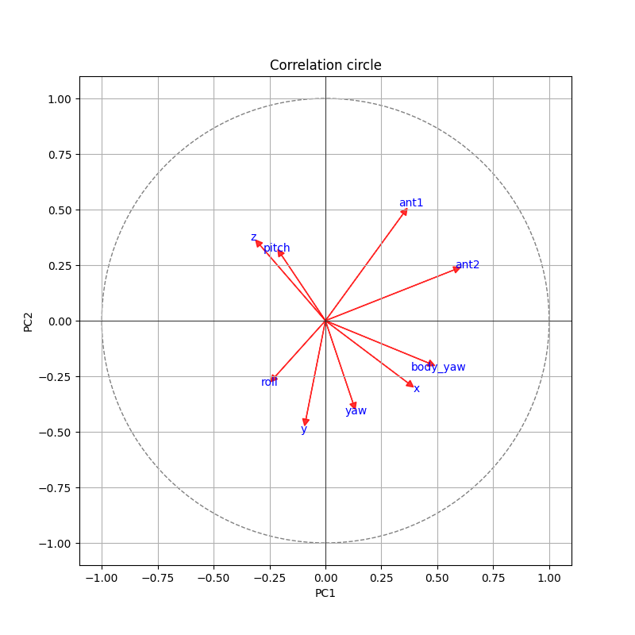
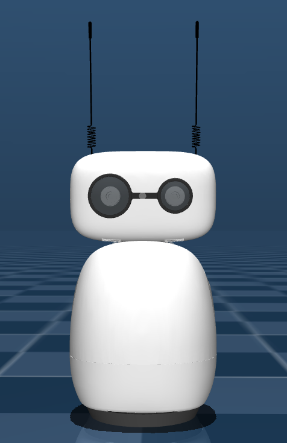
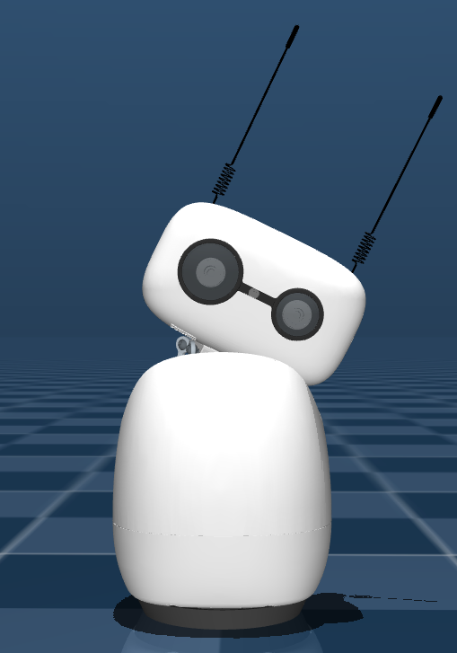
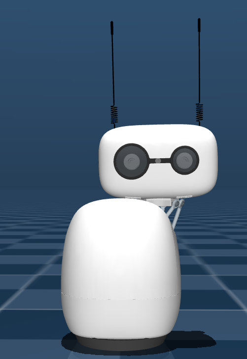

# Reachability rules extraction

Rules extraction is necessary to allow the reachabilty of a pose.

- [Reachability rules extraction](#reachability-rules-extraction)
  - [Definition of parameters](#definition-of-parameters)
  - [Feasibility problem](#feasibility-problem)
  - [Empirical exploration of limits](#empirical-exploration-of-limits)
    - [Methodology](#methodology)
    - [Results](#results)
  - [Statistical analysis of dependencies](#statistical-analysis-of-dependencies)
    - [Variable correlation analysis](#variable-correlation-analysis)
    - [Results](#results-1)
  - [Implementation of rules in the robot configuration space](#implementation-of-rules-in-the-robot-configuration-space)
    - [Definition of rules](#definition-of-rules)
    - [Limit Values Extraction Script](#limit-values-extraction-script)
    - [Results](#results-2)
    - [Discussion on Variables](#discussion-on-variables)
  - [Perspectives for the reachability problem](#perspectives-for-the-reachability-problem)


## Definition of parameters

A pose is defined by the following parameters : 
1. ``head`` (4x4 matrice)
2. ``antennas`` (1D vector)
3. ``duration`` (float)
4. ``method`` ("linear", "minjerk", "ease", "cartoon")
5. ``body_yaw`` (float)

An important thing to take into account is the formation of the head matrice. It can be created by the `create_head_pose()` command, which takes as input these parameters:
1. ``x``: float = 0,
2. ``y``: float = 0,
3. ``z``: float = 0,
4. ``roll``: float = 0,
5. ``pitch``: float = 0,
6. ``yaw``: float = 0,
7. ``mm``: bool = False,
8. ``degrees``: bool = True

For this experiment, the parameters ``mm`` and ``degrees`` will be let as True.

## Feasibility problem

The aim of this part is to find limitations for each of the possible variables. Some poses are theoretically possible to execute, but convey to an error if they are physically executed by the robot. We aim to obtain an output of this form : 

```
def pose():
    return {
        "x": int(-40, 40),
        "y": int(-60, 60),
        "z": int(-60, 60),
        "roll": int(-50, 50),
        "pitch": int(-50, 50),
        "yaw": int(-65, 65),
        "body_yaw": int(-20, 20),
        "antennas": [
            rfloat_1(0.0, 2*3.14),
            rfloat_1(0.0, 2*3.14),
        ],
    }
```

However, these values are not always reachable without generating a bug. They represent the current limits of the robot movements, but are **inacurate**. In order to generate an executable pose, they must be defined by realistic values. For this, a set of **rules** can be defined.

## Empirical exploration of limits 

No anlytical model of the physical constraints of the robot was found. Hence, a data-driven approach was adopted.

In order to extract coherent values for the limits of the robot poses, a dataset have been created by hand. The dataset creation is available in the [robot_space_limit_testing.py](robot_space_limit_testing.py) script.

### Methodology

The script generates a set of random poses for the robot. The evaluator has to label it as 1 if OK, and 0 if non-OK, into the terminal. The number of randomly generated poses can be changed. Once the script has generated the given number of poses and the evaluator has labelled them, a .json file is generated, containing the poses parameters values and their label.

### Results

The final dataset can be found under the name [pose_dataset_2.json](pose_datasets/pose_dataset_2.json).

**Note :** There is also a dataset named [pose_dataset_1.json](pose_datasets/pose_dataset_1.json), but it is now obsolete due to structural change into the analysis scripts. However, it can be used. Only the analysis scripts need to be adapted.

## Statistical analysis of dependencies

Some variables are highly correlated with others, and knowing this will help defining limitation rules. For instance, when the robot has the head rather down, then it cannot really rotate it from backwards to forwards.

To be able to see which variables are intrinsically correlated, a **Principal Component Analysis (PCA)**. This can be done with the Python library `sklearn.decomposition`, from which the `PCA` module can be imported.

### Variable correlation analysis

The [correlation_analysis.py](correlation_analysis.py) script browses a given dataset to make a PCA on the data. It collects the **features** in a vector $X$ containing the following columns:

- x
- y
- z
- roll
- pitch
- yaw
- body_yaw
- ant1 (first antenna)
- ant2 (second antenna)

Then, these variables are standardized, by the following formula:

$X = \frac{X - \mu}{\sigma}$,

with $\mu$ the mean $X$ of the dataset and $\sigma$ the standard deviation. After this, the PCA can be exectued with the line `X = pca.fit_transform(X)`. This allows to project $X$ onto the computed components. Here, `pca` is an instance of the object `PCA`, which has some attributes line the components and variables, and to which are associated some methods, as `fit_transform`.

Finally, the components can be extracted from the object, and shown onto the correlation circle.

**NB:** Two dimensions have been used to represent data, for clarity.

### Results

The correlation circle obtained from the dataset is the following one:


It can be observed that $pitch$ is highly correlated with $z$, $roll$ with $y$ and $x$ with $yaw$ and $body$ $yaw$.

The antenas do not seem to be correlated with $z$, nor with $x$, due to the angle that is close to 90°. At least, $ant1$ with $x$, and $ant2$ with $yaw$, knowing that $x$ and $yaw$ are highly correlated. However, they do seem to be inversely correlated with $roll$. If we observe the impact of $roll$ which is correlated to $y$ on Reachy Mini, here is what we get:

|                              Classic                              |                        Impact of $roll$                         |                       Impact of $y$                       |
| :---------------------------------------------------------------: | :-------------------------------------------------------------: | :-------------------------------------------------------: |
|  |  |  |

It can be confirmed that these variable do influence if the antennas will go through the body of the robot or not, however, so do the other ones, mostly $pitch$ and $yaw$. Hence, the analysis concerning the antennas needs to be reviewed.

In the future, for more precision, it will be possible to proceed to a **multiple linear regression** to analyse the model, so that the most significant variables can be extracted in the interest of the antennas. In a first place, only the 7 other variables will be used to define space constraints.

## Implementation of rules in the robot configuration space

Based on the observed correlations, **linear dependency rules** are defined to restrict the robot configuration space to physically reachable poses.

In order to define them, it is necessary to check which position is right, which one is wrong. As shown in the correlation analysis, $pitch$ is highly correlated with $z$, $roll$ with $y$ and $x$ with $yaw$ and $body$ $yaw$.

### Definition of rules

Hence, 3 two-by-two dependent rules can be set. For each of these rules, 3 parameters are calculated, from each pose :

1. The gain $a$,
2. The offset $b$,
3. The standard deviation $sigma$.

Let $r$ be a rotationnal parameter such as $roll$, $pitch$ or $yaw$, and $p$ a prismatic one, such as $x$, $y$ or $z$. A rule should be of the following form:

$r = ap + b \pm sigma$

The extracted rules do not represent exact physical constraints, but rather a linear approximation of the feasible region, sufficient for pose generation purposes. Its parameters are described in the 3 following paragraphs.

1. **The gain $a$ (slope)** | It represents how much the first variable is influenced by the second one. For instance, for $pitch = a \times z$, it shows how much the head pitch changes when the vertical translation $z$ changes by one unit.
   
    If $a$ is really small, $z$ will not have a high influence on the pitch. On the contrary, if $a$ is high, then there is a high geometrical constraint.

2. **The offset $b$ (intercept)** | It represents the neutral position of the head, when the second variables is equal to 0.
    
    For instance, for $pitch = az + b$, then $b$ will be the initial point from where the head will rotate of an $a$ factor towards $z$.

3. **The standard deviation $sigma$ (tolerance)** | It quantifies possible variability around a neutral pose.
  
    For instance, in $pitch = az + b \pm sigma$, $sigma$ defines a tolerance band around the mean relation, within which poses are considered reachable.

This form will allow to set coherent limitation rules to the robot poses.

### Limit Values Extraction Script

The [rules_extraction.py](rules_extraction.py) script has been created in order to extract rules from a given dataset. If a pose is labelled as non-OK, then this position should not be reached. The script uses multiple linear regression to extract all the fitting values from the dataset, and thus proposes limit values.

### Results
The results of the limit values are available into the [rules_1.json](rules/rules_1.json) file. They have been computed according to the [pose_dataset_2.json](pose_datasets/pose_dataset_2.json) dataset, and propose $a$, $b$ and $sigma$ values for each one of the 3 rules.

A second iteration have been made, with these extracted rules taken into account to create poses. The corresponding dataset is [pose_dataset_3.json](pose_datasets/pose_dataset_3.json). It has been combined to the previous one to extract new rules, available in the [rules_2.json](rules/rules_2.json) file.

### Discussion on Variables

During the tests, it has been realised that not all of the variables had an important impact on the final pose. Hence, for clarity reason, at this point of the experiment, new decisions have been made : 

1. **Antennas** movement will be wider as the robot goes higher and forward.
   
2. The **`body_yaw`** parameter will not be taken into account into the rules.

## Perspectives for the reachability problem

Reachability rules have been set, and they are helpful to avoid some critical poses. However, the robot still goes through some questionnable poses.

Hence, the next step may be to make a deeper analysis, by evaluating the influence of each variable on the other, for the head. For this, a **multiple linear regression** can be done.